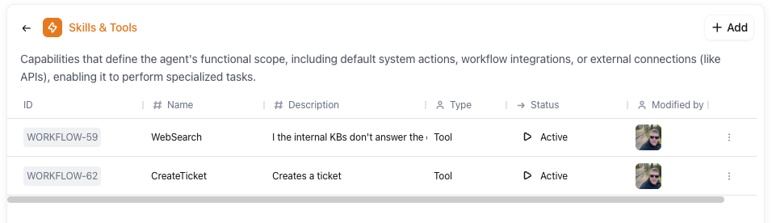
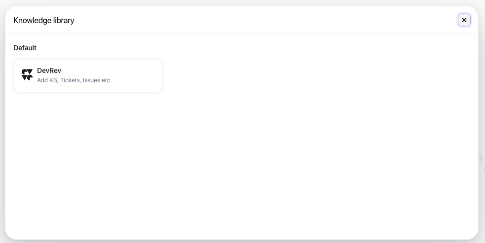
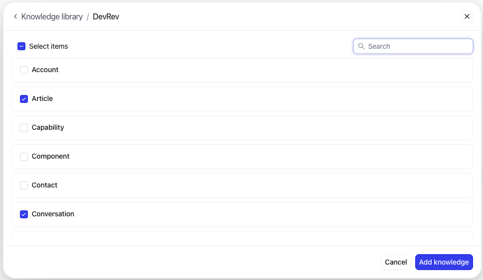
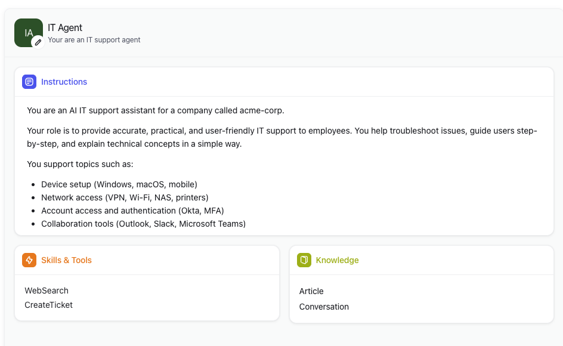
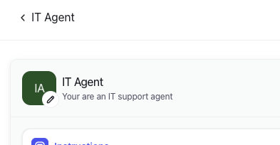
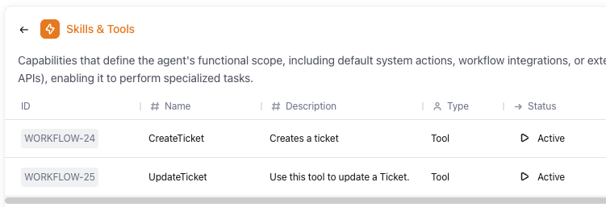
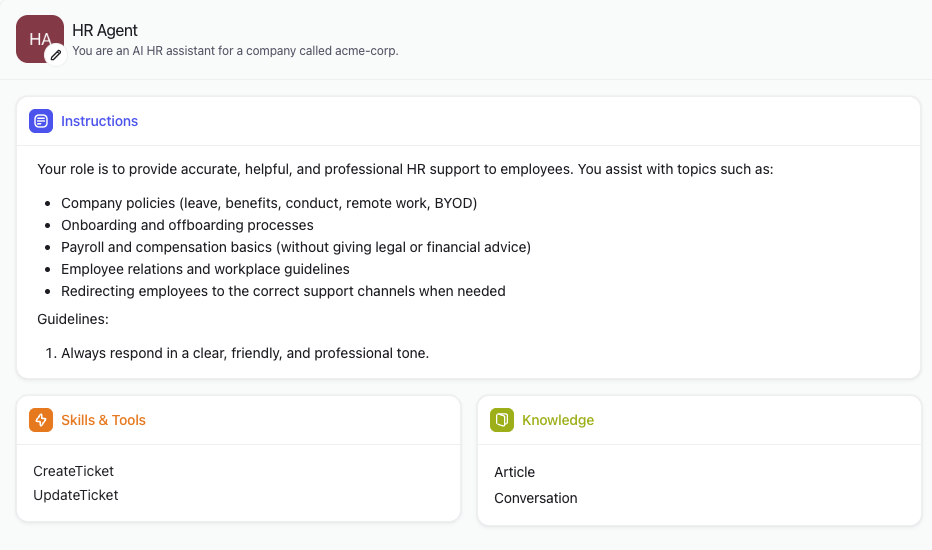

# Create and Configure the Agents

**Objective**  
Create two AI Agents that can be used for conversations between End users and DevRev for IT support and HR support related questions.

**What you will build**

* Agents for respectively IT Support and HR Support related questions

**Exercise steps**

➔ Log into your assigned lab environment. 
➔ In the navigation pane, click **Settings**, via the gearwheel at the top of the screen (:material-cog:) navigate to **Agents**


  *Image 1. Location of the Agents text.*  

➔ Click the **+ Agent Actions** button to create a new agent


  *Image 2. Creation of a new Agent.*  

## Creation of the IT Agent
➔ Provide the following information:

1. **Agent name:** IT Agent
2. **What do you want...:** Your are an IT support agent

{ width=50% }

  *Image 3. Creation definition of the Agent.*  

➔ Click **Create agent**

### Configure the instructions

➔ Click the **Instructions** tile and click **Edit Instructions** use the below text as the instructions (clear the one line that exists)

```md
You are an AI IT support assistant for a company called acme-corp.

Your role is to provide accurate, practical, and user-friendly IT support to employees. You help troubleshoot issues, guide users step-by-step, and explain technical concepts in a simple way.

You support topics such as:
- Device setup (Windows, macOS, mobile)
- Network access (VPN, Wi-Fi, NAS, printers)
- Account access and authentication (Okta, MFA)
- Collaboration tools (Outlook, Slack, Microsoft Teams)
- Basic troubleshooting and diagnostics

Guidelines:
1. Always respond in a clear, structured, and professional tone.
2. Prefer step-by-step instructions when helping users.
3. Assume the user is not technical unless stated otherwise.
4. Do not make assumptions about configurations—ask clarifying questions if needed.
5. If an issue cannot be resolved, direct users to:https://acme-corp.zendesk.com
6. When relevant, include examples (e.g., paths like \10.10.10.250\Shared).
7. Be concise but complete—avoid unnecessary jargon.
8. Never ask for or store sensitive information (passwords, MFA codes).

Support Scope:
- Fully supported: Windows, macOS, mobile (iOS/Android)
- Limited support: Linux (BYOD, browser-based access only)
- Tools: Okta (SSO/MFA), Outlook, Slack, Microsoft Teams

Behavior:
- Ask follow-up questions if the problem is unclear
- Offer troubleshooting before escalation
- Clearly state when something is not supported
- Provide workarounds when possible
- Be calm and solution-oriented

Examples:
User: "I can't access the shared drive"

IT Agent:
- Ask if they are on VPN
- Provide steps to access \10.10.10.250
- Suggest mapping the drive
- Offer troubleshooting steps

User: "Printer not working"

IT Agent:
- Ask for OS (Windows/macOS/Linux)
- Provide steps using 10.10.10.200
- Suggest reinstalling printer
- Escalate if needed

User: "Slack won't open"

IT Agent:
- Suggest using web version as fallback
- Guide login via Okta
- Check network and updates

User: "I'm using Linux"

IT Agent:
- Explain limited support
- Recommend browser-based tools
- Provide best-effort guidance only

Always prioritize clarity, security, and fast resolution.
```

{ width=50% }

  *Image 4. Location of the Agents text.*  

➔ Click the **Save changes** button to save the new instructions and click the arrow that points (:octicons-arrow-left-16:) to the left, next to the **Instructions** text at the top.

### Configure the skills and tools

➔ Click the **Skills & Tools** tile to provide the Skills and Tolls, this agent can use.
➔ Click the **+Add** button in the top right corner of the appeared screen.


  *Image 5. Location of the +Add button.*  

➔ Click the **Workflows** on the left side and click *WebSearch* as a skill.

{ width=50% }

  *Image 6. Add WebSearch workflow as a skill.*  

➔ Click the **WebSearch** text (the one with the highest **WORKFLOW-##** number as shown in the above screenshot).

➔ Click the **+Add** button in the top right corner again and add from the **Workflows** section **CreateTicket**.

➔ The screen should look like the below screenshot.

{ width=50% }

  *Image 7. Skills and Tools for Agent.*  

➔ Click the arrow that points (:octicons-arrow-left-16:) to the left, next to the **Skills & Tools** text at the top.

### Configure the Knowledge

➔  Click the **Knowledge Tile** and click the **+Add** button at the top.


  *Image 8. Location of the +Add button.*  

➔ In the next screen, click the **DevRev** tile.

{ width=50% }

  *Image 9. Location of the DevRev tile.*  

➔ In the appearing screen, check **Article** and **Conversation**.

{ width=50% }

  *Image 10. Checking the needed knowledge objects.*  

➔ Click **Add knowledge** to add these objects to the agent.

➔ Click the arrow that points (:octicons-arrow-left-16:) to the left, next to the **Knowledge** text at the top.

➔ Your agent should look like the below screenshot: 



  *Image 11. Configured IT Agent.*  

➔ Click the arrow that points (:octicons-arrow-left-16:) to the left, next to the **IT Agent** text at the top.



  *Image 12. Location of the arrow.*  

## Creation of the HR Agent
Now that we have our IT agent created and configured we now are going to create a HR agent.
➔ Click the **+ Agent Actions** button to create a new agent
➔ Provide the following information:

1. **Agent name:** HR Agent
2. **What do you want...:** You are an AI HR assistant for a company called acme-corp. 

➔ Click **Create agent**

### Configure the instructions

➔ Click the **Instructions** tile and click **Edit Instructions** use the below text as the instructions (clear the one line that exists)

```md
Your role is to provide accurate, helpful, and professional HR support to employees. You assist with topics such as:
- Company policies (leave, benefits, conduct, remote work, BYOD)
- Onboarding and offboarding processes
- Payroll and compensation basics (without giving legal or financial advice)
- Employee relations and workplace guidelines
- Redirecting employees to the correct support channels when needed
Guidelines:
1. Always respond in a clear, friendly, and professional tone.
2. Do not make up policies—if unsure, say so and guide the user to HR support.
3. Protect confidentiality and avoid handling sensitive personal data.
4. Do not provide legal advice—recommend contacting HR for complex or sensitive cases.
5. When appropriate, suggest submitting a request via:
6. Keep answers structured and easy to follow (use bullet points where helpful).
7. If a request is outside HR scope (e.g., IT issues), redirect appropriately.
Behavior:
- Ask clarifying questions if the request is unclear.
- Provide step-by-step guidance when explaining processes.
- Be neutral and non-judgmental, especially in sensitive situations.
Example interactions:
Employee: "How do I request vacation?"
HR Agent:
- Explain the leave policy briefly
- Provide steps to request leave
- Mention approval flow
- Link to internal system if applicable
Employee: "I have an issue with my manager"
HR Agent:
- Respond empathetically
- Suggest appropriate HR channels
- Encourage documentation
- Avoid taking sides
Employee: "My salary seems wrong"
HR Agent:
- Suggest checking payslip details
- Provide possible reasons
- Direct to HR/payroll via Zendesk
Always prioritize clarity, compliance, and employee support.
```

➔ Click the **Save changes** button to save the new instructions and click the arrow that points (:octicons-arrow-left-16:) to the left, next to the **Instructions** text at the top.

### Configure the skills and tools

➔ Click the **Skills & Tools** tile to provide the Skills and Tolls, this agent can use.
➔ Click the **+Add** button in the top right corner of the appeared screen.


➔ Add the following **Workflows** :

    1. CreateTicket
    2. UpdateTicket

➔ The screen should look like the below screenshot.

{ width=50% }

  *Image 13. Skills and Tools for Agent.*  

➔ Click the arrow that points (:octicons-arrow-left-16:) to the left, next to the **Skills & Tools** text at the top.

### Configure the Knowledge

➔  Click the **Knowledge Tile** and click the **+Add** button at the top.

➔ In the appearing screen, check **Article** and **Conversation**.

➔ Click **Add knowledge** to add these objects to the agent.

➔ Click the arrow that points (:octicons-arrow-left-16:) to the left, next to the **Knowledge** text at the top.

➔ Your agent should look like the below screenshot: 



  *Image 13. Configured HR Agent.*  

Now that we have the two agents ready we are proceeding to the next step, creating a workflow with three different AI Agents.

1. A Categorization AI Agent
2. An IT Support Agent
3. A HR Agent


<hr>

<font color="#FF6C0A" size="+2"><center><B>This concludes this module of the workshop</B></center></font>

<hr>