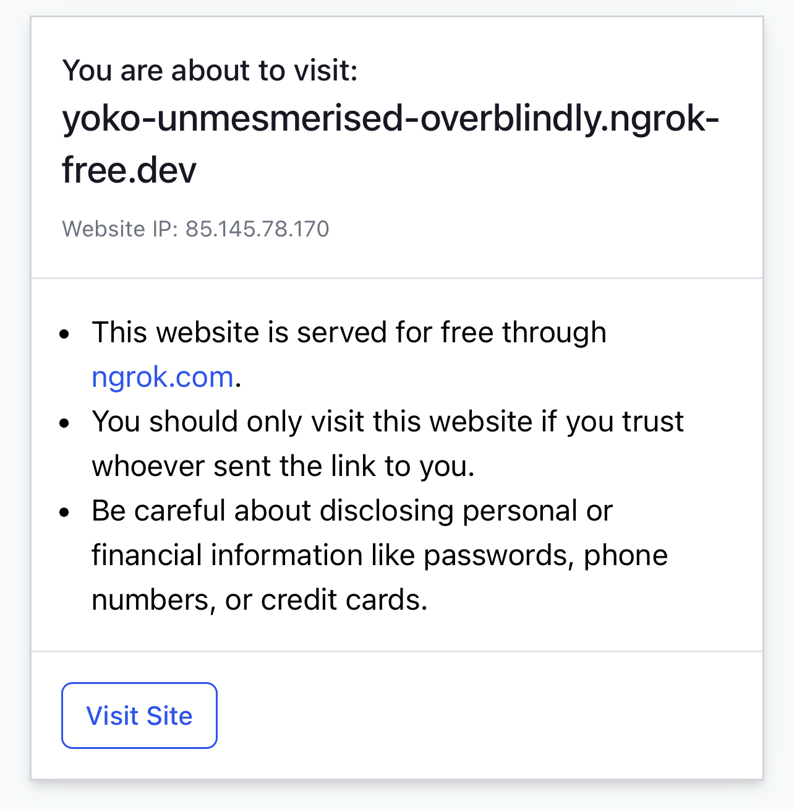
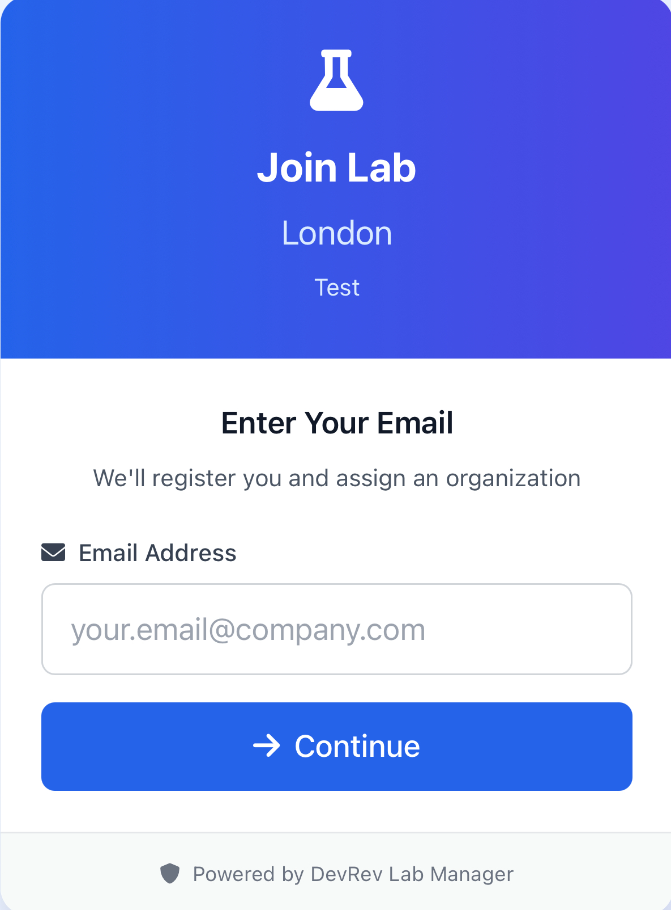
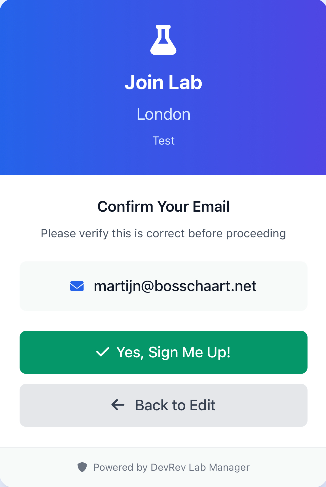
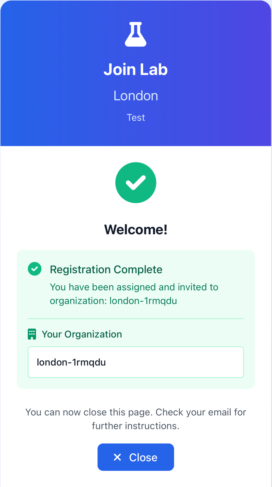
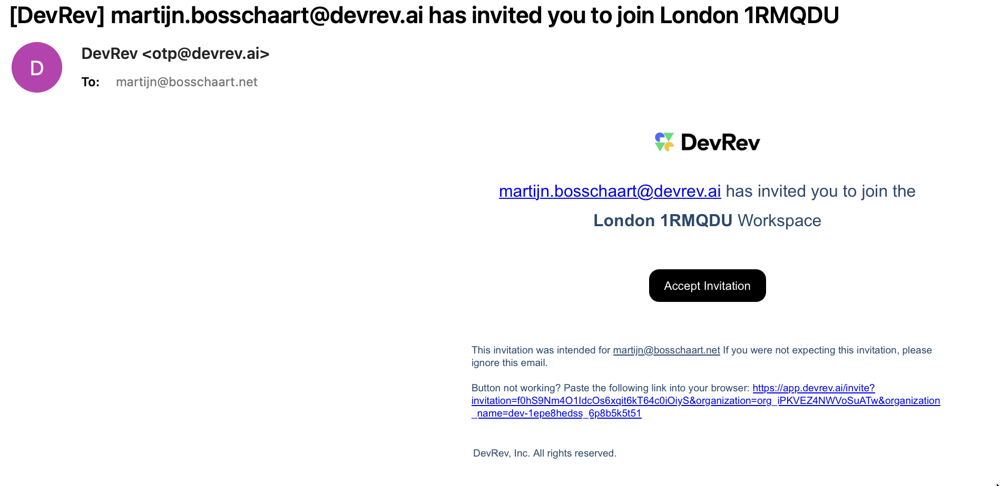
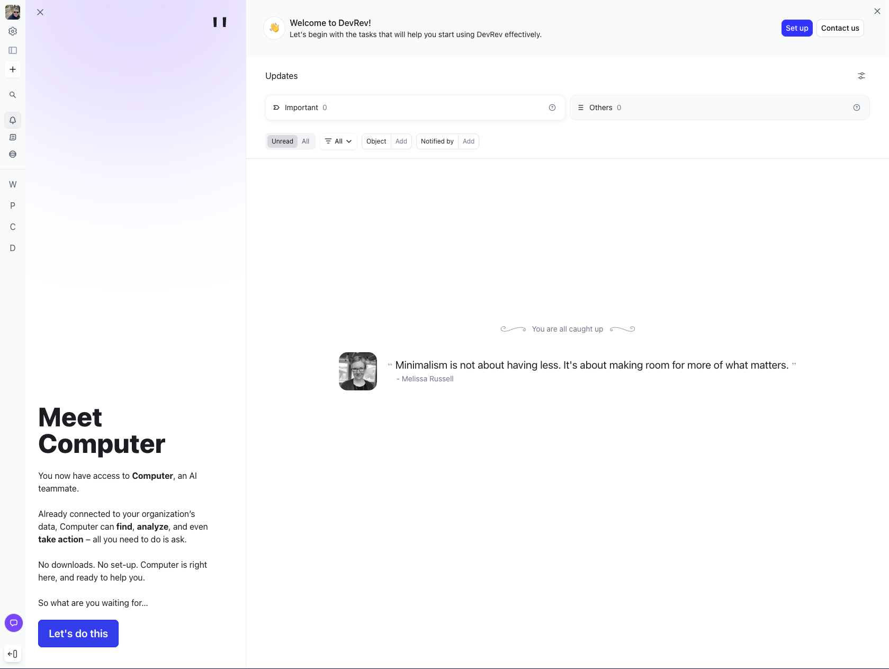

# Lab environment registration instructions {#lab-environment-registration-instructions}

To be able to access the lab environment you need to register first.

The instructors will present you with a QR-code you can open with your phone. 

(Note: During the lab session Ngrok might be used to route external traffic to the labmanager tool, so you could see an odd ngrok url like in the example below, and it also might ask you if you want to visit this site. We can assure you this is perfectly safe)

{ width=33% }

*Image 1\. NGROK confirmation (optional).*

This will then guide you to a sign up page where you need to enter your email address. Enter your address and follow the instructions on screen to register for a lab. 

{ width=33% } { width=33% } { width=33% }

*Image 2\. Mobile Lab Signup.*  

You will then be issued a Computer “org” with its ID mentioned in the app, and two emails will be sent to the address you specified. 

The first one is an email with further information about the labs such as needed login credentials and predefined prompts you can then copy paste easily into your lab when referenced. You can also view its content via the website [https://devrev.community/cc](https://devrev.community/cc) if you prefer.

The second email is the actual invitation to join the DevRev Computer lab environment you have been assigned to. This email contains a link you must click to initiate the enrollment.

  

*Image 3\. DevRev Org invitation email.*

- Once you click the link, you will be taken to a browser page where you need to configure your user account, the first setting being the language.

- A new message will appear and your environment should be shown in a few seconds.

  

*Image 4\. DevRev Org Web UI.*  

You are ready to start the Lab\!

Have fun\!