# Create the Workflow

**Objective**  
Create a workflow that will use a catagorization agent to have the correct AI agent answer the questions in a conversation with a human.

**What you will build**

* Create a PAT
* Create and Configure a Workflow
  * Import a template
  * Conversation created as trigger node
  * HTTP API Call
  * Categorization Agent
  * If Then Logic
  * Assign IT Support agent
  * Assign HR support agent

**Exercise steps**

➔ Log into your assigned lab environment.  

## Get the PAT
As we are gooing to run an HTTP API call to the environment itself, we need a PAT. The HTTP API call needs to authenticate itelf using a Bearer token and the PAT is exactly that.


!!! TIP
    In production it is best to have a AAT (Application Access Token). To have this created, follow the steps on the support site for Developers at https://developer.devrev.ai/api-reference/auth-tokens/create. You still need a PAT to run the API call. Advantage is that the AAT can be created and revoked on the fly. 

    For this workshop, we will leave the AAT for you to test.

➔ In the navigation pane, click **Account** at the top of the navigation pane.

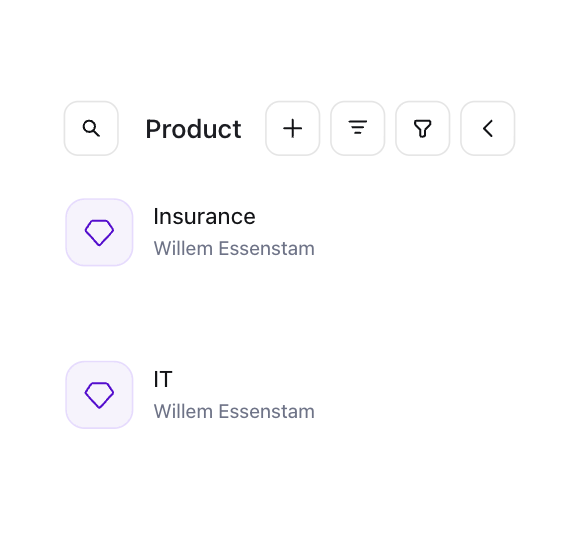

  *Image 14. Location of the Account text.*  

➔ In the **Personal access tokens** click the **+ New token** button.

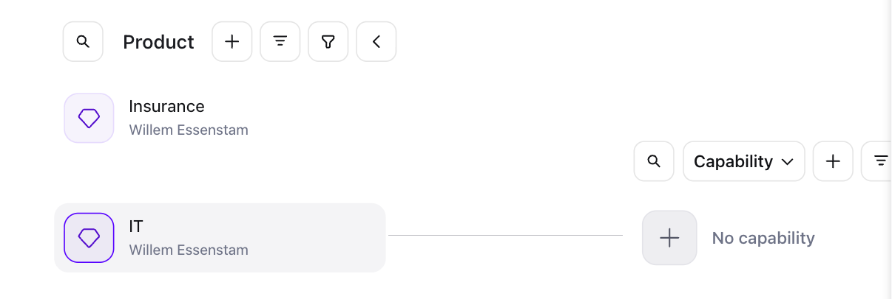

  *Image 15. Location of the Personal access token and button.*  

➔ In the screen that apears, provide a user friendly name for the usage and set the expiration time. As example **API Token** and **90 days**, and click **Generate**

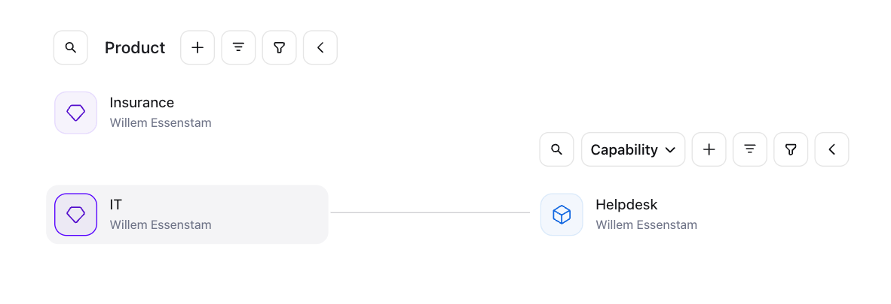

  *Image 16. Create a Personal access token.*  

➔ After you clicked generate, a warning message is shown that the key will only be shown once!!! Copy the PAT, by using the **Copy** button, to a file or a note and save it. We need it later in the creation of the workflow!!!


  *Image 17. The warning and the PAT itself.*  

Now that we have the PAT we can proceed to creating the Workflow

## Create and confgure the workflow

➔ In the navigation pane, navigate to **Workflows**


  *Image 14. Location of the Workflows text.*  

### Create a Workflow from a JSON template

From the second part of this workshop trilogy, you should have saved a JSON file of an existing workflow (Agent Playground workflow).

!!! Abstract "Get the needed Workflow JSON template file"

     If you have lost, or forgotten to save the JSON, Use one of the otions below, if you are viewing this workshop online, use the **Download** option. 

    ??? "Get the JSON from environment"
        ➔ There should be a workflow called **Agent Playground workflow**
        
        { width=70% }
        
        *Image 18. Agent Playground workflow.*  
        
        ➔ Hoover the mouse over the workflow and click it. This will open the details of the workflow.
        
        { width=80% }
        
        *Image 19. The details of the workflow are shown.*  
        
        ➔ Click the **Download** button (:octicons-download-16:) and save the file to a location you can remember as we need the downloaded JSON file in a few.


    ??? "Download"
        [Get the JSON File](./Agent_Workflow.json) (use **right click -> Save Link As..**)
    
➔ Click on **+ Workflow** in the top right corner.


  *Image 20. Location of the + Workflow button.*  

➔ Click the **Import Workflow...** tile.


  *Image 21. The Import tile.*  

➔ In the new screen, a file browser, select the JSON you downloaded or had saved and click **Open**


  *Image 22. Location of the JSON file to be uploaded.*  

➔ After you clicked **Open** a canvas will open that looks something like the below screenshot.


  *Image 23. The canvas from the uploaded JSON file.*  

Now we have a starting point that we need to configure to do what we are looking for.

### Configuring the imported Workflow

➔ Rename the workflow **IT or HR Agent switcher** by double clikcing on the existing name *Agent Playground*. 

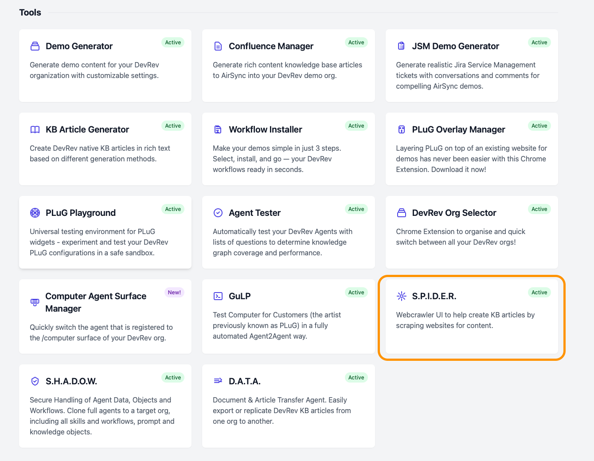

  *Image 24. Rename the workflow.*  

➔ Hit Enter to save the new name.

➔ Click the **Conversation** node

➔ In the right pane that appeared, make sure all fields are empty by using the **Clean** button. Collapse the right pane by clicking the double arrows in the top left corener of the right pane.

➔ In the canvas, click the arrow between the **Conversation Created** and **Talk to Agent** node, and hit the **delete** button on your keyboard.

!!! Abstract "What good looks like" 
    If you have selected it correctly, it will become a dashed line.


  *Image 25. Select a connecting arrow between nodes.*  

➔ If you have done it correctly, you now have two seperated nodes on the canvas.

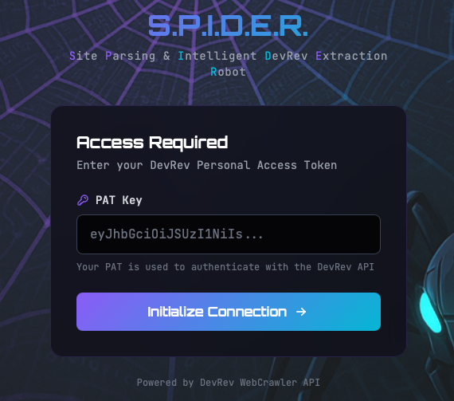{ width=30% }

  *Image 26. Seperated nodes.*  

➔ Click the **+** symbol at the end of the arrow that is starting on the bottom of the **Conversation Create** node, and select the **Action** node.

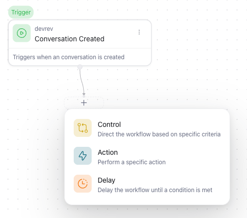{ width=30% }

  *Image 27. Add workflow node.*  

➔ In the new screen, search *HTTP* and click the **HTTP** tile you see as result.

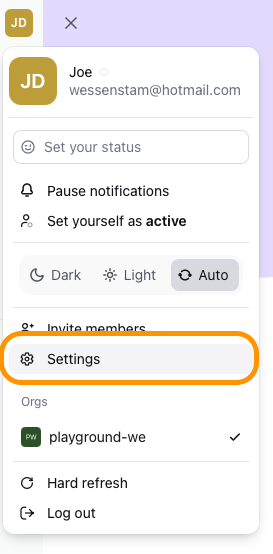{ width=30% }

  *Image 28. HTTP node.*  

➔ In the side pane use the following parameters:

1. **Auth Token:** Follow the below steps:

      - Click **+ Add connection** 

        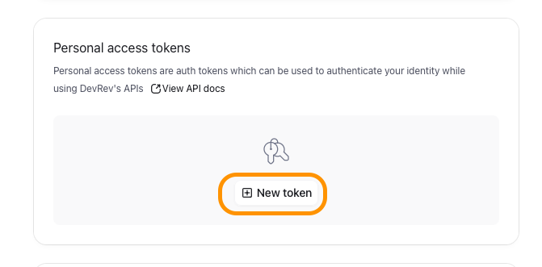{ width=50% }

        *Image 29. Add Connection.*  
    
       - Click the **DevRev** tile.
       
           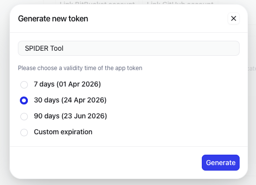

           *Image 30. DevRev tile.*  

        - **Make public:** Toggeled to **on**.
        - **Connection Name:** A user friendly name (ex. *DevRev Environment Connection*).
        - **Person access token:** The token you created earlier.

           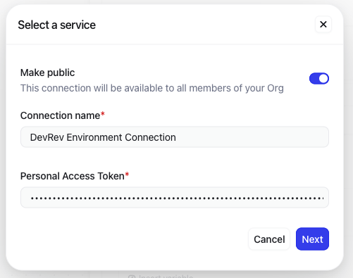

           *Image 31. Connection configuration.*
        - Click **Next**.

2. In the side pane, select the created Connection under **Auth Token**.

    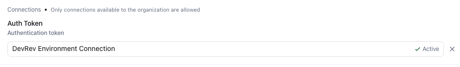

    *Image 32. The Auth Token.* 

3. In the **Url** field use *https://api.devrev.ai/timeline-entries.list* and click the **Save** button.

    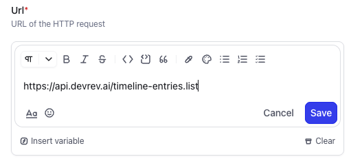

    *Image 33. The URL for the HTTP API call.* 

    !!!Danger "BE AWARE!!"
        When you copy or type the URL, make sure that the text is not a "Code" selection (:material-code-block-tags:). If you see something like *MD* mentioned, make sure to deselect the Code icon. If you don't do this, the HTTP API will throw an error!!!

4. Change the Auth Type field to **Bearer**.

    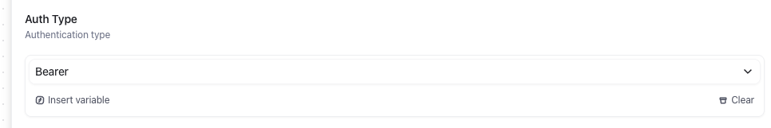

    *Image 34. The Auth Type HTTP API call.* 


5. Change the *Method* to **POST**

    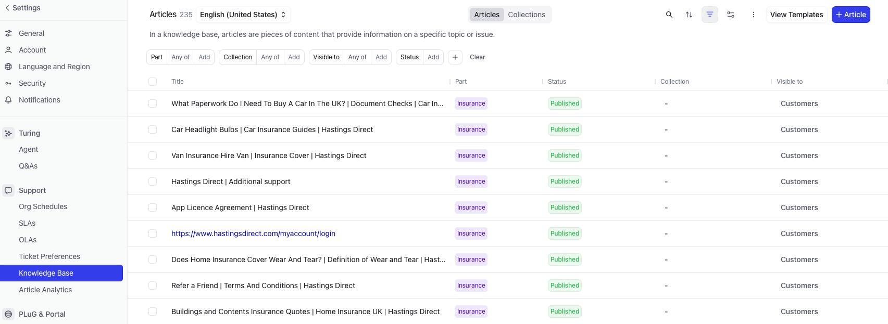

    *Image 35. The Method for the HTTP API call.* 

6. Click the **+ Add attribute** at the bottom of the side pane and select **Body**, and click somewhere in the side pane to have the attribute available.

    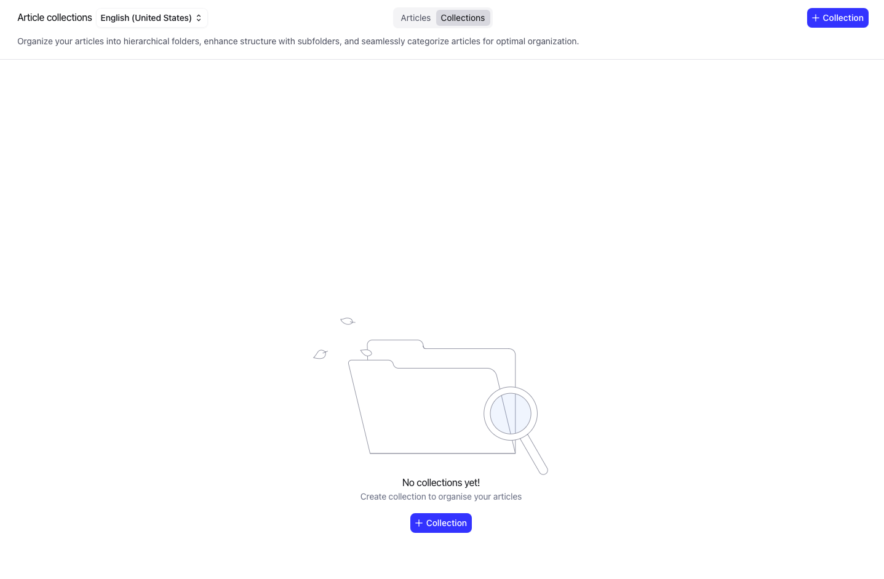

    *Image 36. The Body for the HTTP API call.* 

7. In the Body field, type the following information **{"object":""}**. Put the cursor in the middel of the two double quotes and click **Insert variable** just below the field.

    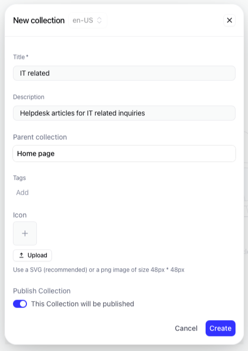

    *Image 37. Configuring the Body. Location of the cursor and the Insert variable for the HTTP API call.* 

8.  Select **Conversation > Output > ID** (all the way at the bottom of the extra side pane)

    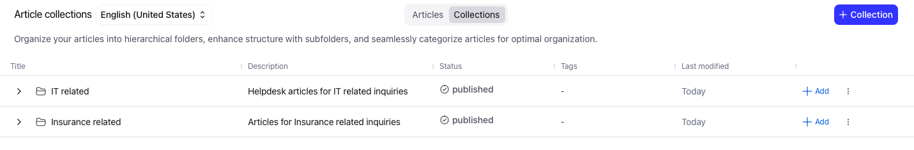

    *Image 38. The location of the needed variable for the HTTP API call.* 

9. Your body should now look **exactly** like the below screenshot.

    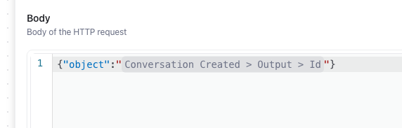

    *Image 39. The full Body for the HTTP API call.* 

➔ All not mentioned sections, leave them default.

### Test the HTTP API call

Now that we have the HTTP API call configured, we have the possibility to test it. 

➔ In the top of the side pane, you see a **Play** button (:material-play-outline:). click this button

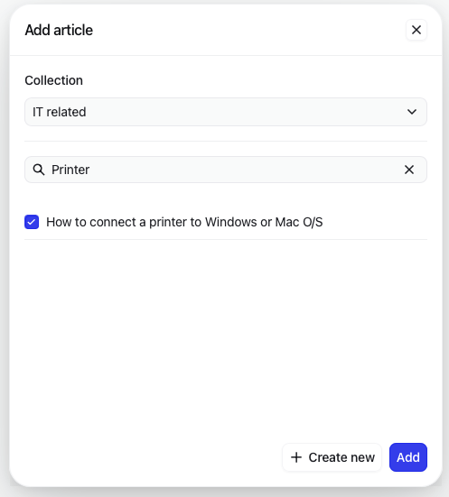

  *Image 40. The test button.*  

➔ An extra new side pane opens. Use the following parameters to test the HTTP API call:

1. **Auth Token**: Select the earlier created Connection. 

    !!! Warning
        If you don't see your connection being shown, you have forgotten to toggle the **Make Public** switch!!! To get that sorted, navigate to **AirSync** and in the top right corner is a button called **Connections**. Click the button, this will show ALL connections. One of the is the earlier created connection. On the far right of that connection name are **three dots**. Click the dots and select **Share**. Then toggle the **Anyone in demowe** switch.

        Now return to **Workflows > Select the Draft tile** at the top of the screen and you will find your Workflow you were working on before. Click it and you're back in the Canvas. Click the **HTTP** node and the **Play** button to return to the testing the HTTP API call.


2. In the **Id** field, select one of the **Conversations Ids**.

    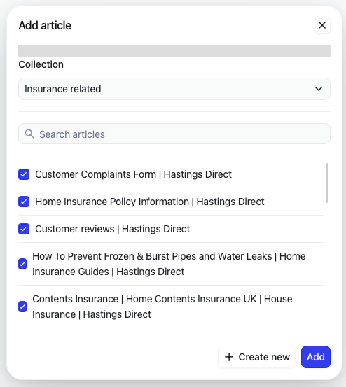

    *Image 41. The test fields.*  

3. Now click the **Execute** button and the Putput should show information.

    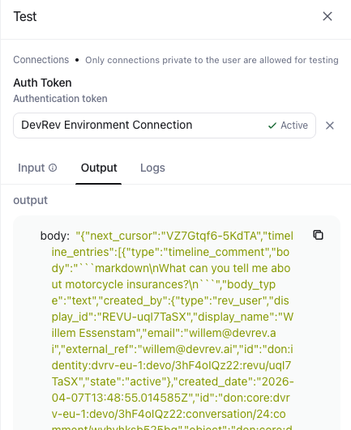

    *Image 41. The output of the test run.*  

    !!! Abstract "Most common issues"
        When no data is returned, but an error thrown, here are the most common issues:

        1. The Auth Token is not set in the test pane
        2. The Address is the Uri field is incorrect
        3. The Body is not correctly set up.

        Check these three items and if all seems ok, ask for help.

### Ask AI node

➔ To return to the canvas, click the double arrows (:material-chevron-double-right:) pointing right at the top of the side pane just above HTTP and its icon.

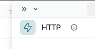

  *Image 42. Collapsing the side pane.*  

➔ Click the **+** symbol on the bottom side of the *HTTP node*.

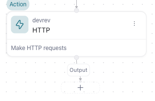{ width=30% }

  *Image 43. Add workflow node.*  

➔ Click **Action node**

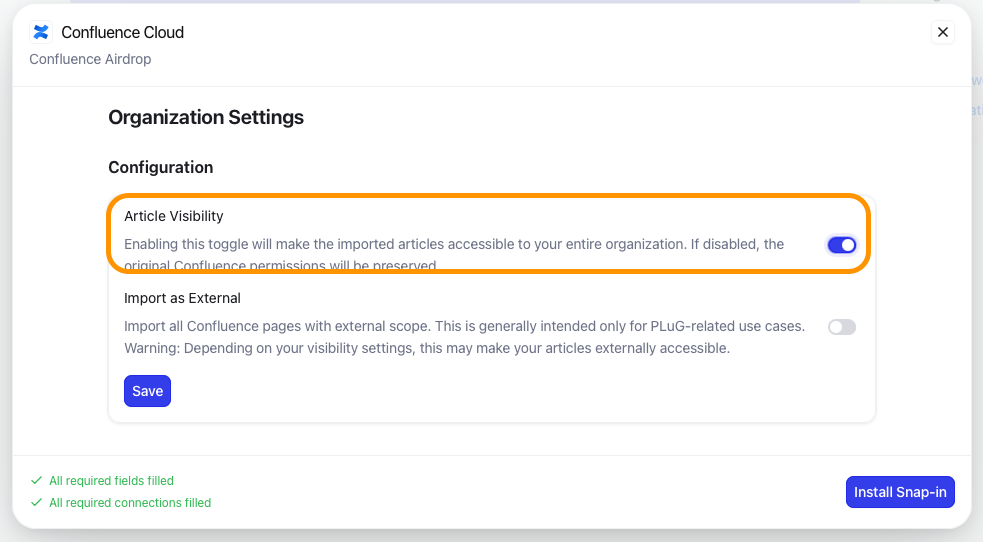{ width=30% }

  *Image 44. Add Action node.*  

➔ Type **Ask AI** in the search bar and click the *Ask AI Tile*.

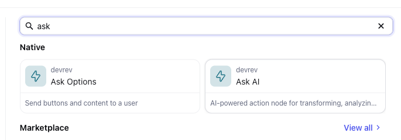

  *Image 45. Add Ask AI node.*  

➔ In the new side screen use the following information:

1. Double click the text **Ask AI** and chnage the name to **Categorization Agent** and hit the Enter key on your keyboard.
2. **Prompt**: Use the below prompt for the Agent:

    ```md
    You are a categorization agent.

    Your task is to analyze the user’s message and determine whether it belongs to one of the following categories:

    1. HR
    2. IT Support

    ---

    ### 📂 Category Definitions

    **HR (Human Resources)**
    Questions related to:

    * Leave policies (vacation, sick leave, parental leave)
    * Expenses and reimbursements
    * Travel policies
    * Employee benefits
    * Workplace policies and conduct
    * Payroll or compensation (general questions)

    **Examples:**

    * "I have a question on leave policies"
    * "What is the policy for expenses?"
    * "What do I need to know for travel?"

    ---

    **IT Support**
    Questions related to:

    * Access to systems or applications
    * Hardware requests (laptop, mobile devices)
    * Software issues or setup
    * Network, VPN, printers, NAS
    * Authentication (Okta, MFA)
    * General technical problems

    **Examples:**

    * "What is needed to get access to SalesForce?"
    * "How do I request a new Laptop?"

    ---

    ### ⚙️ Decision Rules

    * Carefully analyze the intent of the user’s request.
    * If the request clearly relates to HR → categorize as HR.
    * If the request clearly relates to IT → categorize as IT_Support.
    * If the request is unclear or ambiguous → DO NOT categorize.

    ---

    ### 📤 Output Rules (STRICT)

    * ONLY output one of the following exact values:

      * HR
      * IT_Support

    * DO NOT add explanations, punctuation, or extra text.

    * DO NOT output anything else.

    ---

    ### ❓ If Unclear

    If the request is ambiguous or lacks sufficient detail:

    * DO NOT output a category
    * Ask a clarifying question instead

    ---

    ### ✅ Examples

    Input: "How do I reset my password?"
    Output: IT_Support

    Input: "How many vacation days do I have?"
    Output: HR

    Input: "I need help"
    Output: (ask clarification, no category)
    ``` 

    Before you click the save button, make sure at the last line you add this text:
    ```md 
    Your received message is  
    ```
    And then click **Insert variable** at the bottom of the section and select **HTTP > Output > Body**. This is the JSON we got returned from the API call we sent earlier.

    The last part of the prompt should like the below screenshot:


    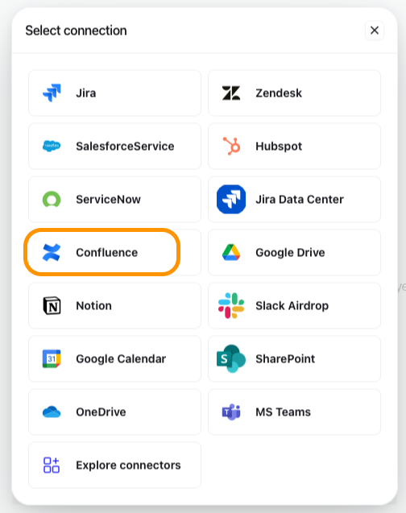{ width=60% }

      *Image 46. Add workflow node.*  

➔ Click **Save**

➔ Leave the rest of the fields default


!!! Abstract 
    As we have said to the agent that it can only output a category if it can decide on one, ```### 📤 Output Rules (STRICT)``` we can use the output of the Agent to make the switch between the agents by using a *Control node*.

!!! Warning "Be Aware"
    The *Categorization Agent* will not be involved again if in a conversation the user changes the context from HR to IT or v.v. For that to work users have to close the conversation and start a new conversation. We could build a solution so this could happen, but is outside of the scope of this workshop.

### Create the Control node

Now that we get a categorization, we need the switch to happen.
➔ Click on the **+** symbol at the bottom of the *Categorization Agent* and select the Control Node.

{ width=30% }

  *Image 47. Add Control node.*  

➔ Select **If Else** node

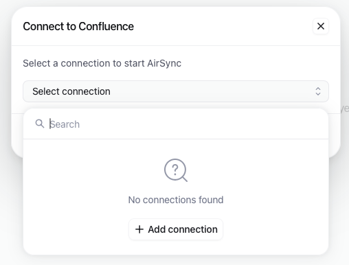{ width=60% }

  *Image 48. Add If Else node.*  

➔ In the side pane use the following setting:

1. Click **Select attribute** and select in the far right **Categorization Agent > Output > Output String**.

    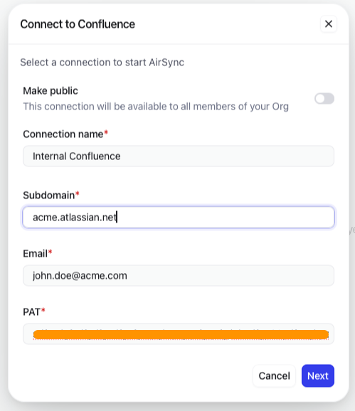{ width=60% }

      *Image 49. Add Attribute to node.*  

➔ Click **Select Operator** and select **Contains**.
➔ Click the text **Select operand type** and select **Add specific value**.

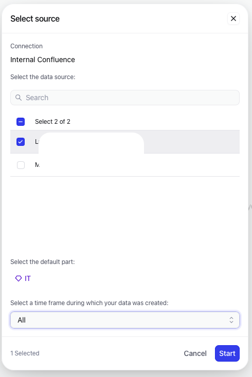{ width=50% }

  *Image 50. Set the operator and operand.*  

➔ Then click the **Add** text and provide the value **HR**.

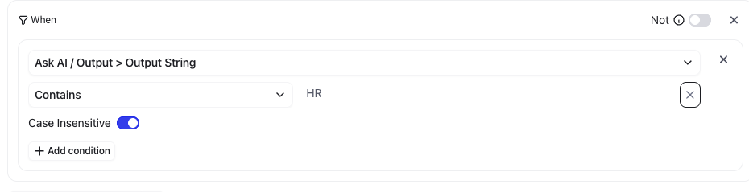{ width=50% }

  *Image 51. Set value for the operand.*  

➔ Collapse the side pane so you can see the canvas again. It shold look something like the below screenshot.

{ width=50% }

  *Image 52. The canvas so far.*  


### Duplicate the seperate Talk to Agent node

As we need to have two Talk to Agent nodes. We need to duplicate the existing one. After that we are going to configure them both.

➔ Click the **Talk to Agent** node and the side pane will open. Collapse the pane as we don;t need it yet.

➔ Now that we have the node selected, click the duplicate icon (:material-content-copy:) at the bottom of the canvas.

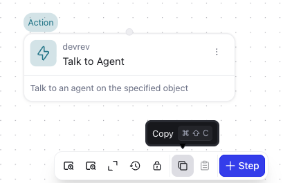

  *Image 53. Copy the node.*  

➔ The clipboard icon (:material-clipboard-text:) will light up. Click this and a second node will be shown.

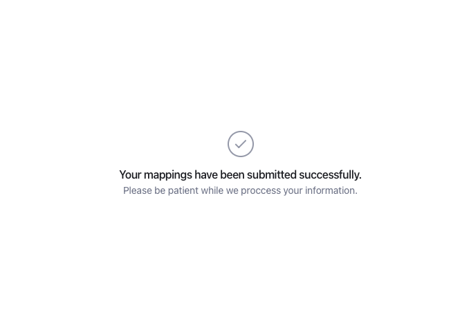

  *Image 54. Paste the node.*  

Now we have two Talk to Agent nodes and can start the configuration of them.

### Configuration of the HR Node

Before we can configure the HR Agent we first need to connect it to the True side of the If-Else control node.

➔ Click the input of the first **Talk to Agent** node and drag it to the True side of the If-Else node.

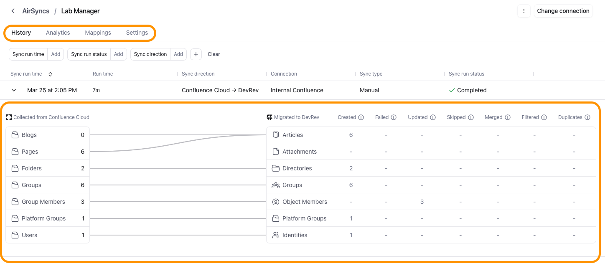{ width=50% }

  *Image 55. Connect the Talk to Agent node to the control node.*  

➔ The node is now connected to the If-Else node. This needs to be done **BEFORE** we configure the HR Agent.

➔ Click the first node called **Tak to Agent** node and type/cofigure the following information in the side pane

1. **Name:** HR Agent
2. **Agent:** Click the **Clear** text and select the **AGENT-3 HR Agent** in the drop down box after you click the text **Add Agent**

    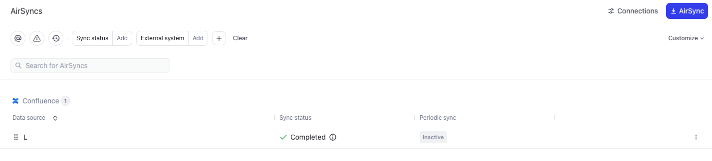{ width=50% }

      *Image 56. Set correct Agent.* 

    !!! Abstract "Be Aware"
        In your environment the AGENT-3 may be a different number.

3. Click the **Clear** text in the *Object* section.
4. Click the **Insert Variable** and select in the far right pane **Conversation Created/Output > Id**

    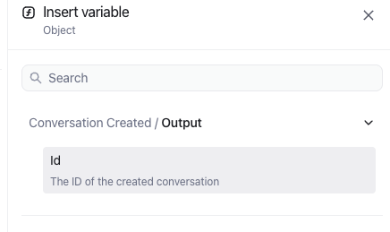

      *Image 57. Set the variable to use.*  

    !!! Danger "Be Aware"
        If you are unable to select a variable, make sure you have the **Talk to Agent** node connected to the **True** side of the **If-Else** control node! Only then can and will variables be available.


5. Leave the rest as is.

!!! Tip
    If a human agent starts answering questions, it should not be that the Agent is also answering and providing information on the human agent's remarks, answers and questions. The Agent should be suspended. To make that happen, click in the bottom of the right pane, **Add attribute** and check the box in front off **Suspend On Message From**

    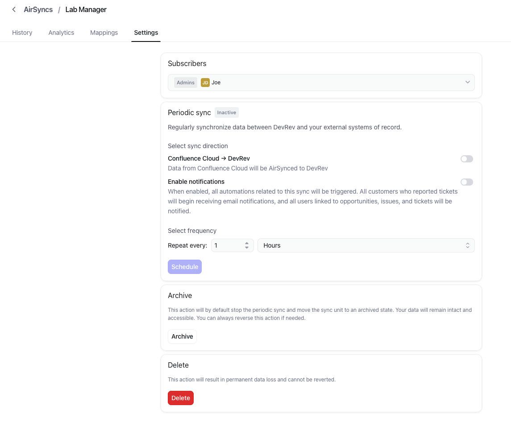{ width=20% }

      *Image 58. Add attribute Suspend On Message From.*

    Click somewhere in the screen to have the attribute added. Then click the text **Add Suspend...** and select **dev_user**

    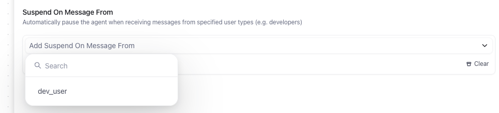{ width=50% }

      *Image 59. Activate to suspend the agent on dev_user (human agent) answering in the conversation.*  

### Configuration of the IT Agent
Now that we have the HR agent ready and connected, we can proceed with the IT Agent. Repeat the steps of the HR agent, but use the below information,

➔ Connect the input of the **Talk to Agent 2** to the False output of the **If Else** control node.
➔ Use the following paramters for teh IT Agent:

1. **Name:** IT Agent
2. **Agent:** AGENT-4 - IT Agent
3. Click the **Clear** text in the *Object* section.
4. Click the **Insert Variable** and select in the far right pane **Conversation Created/Output > Id**
5. Leave the rest default. Your Agent configuration should look like the below screenshot.

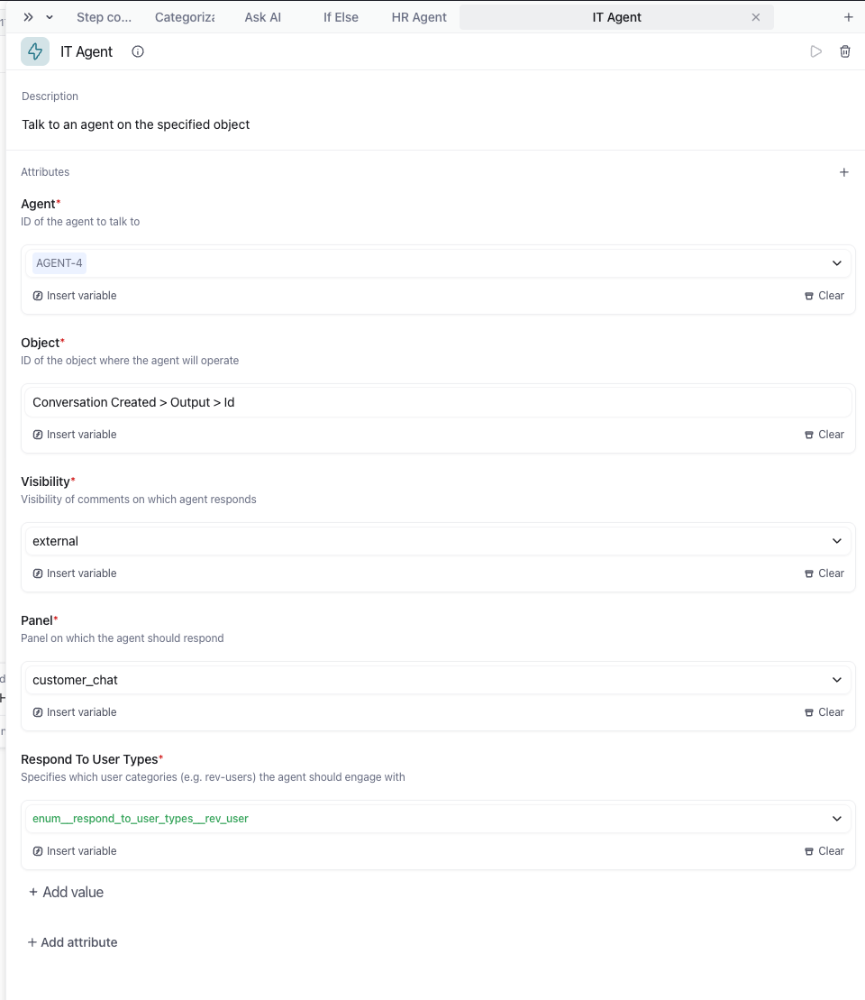{ width=50% }

  *Image 60. The IT Agent node configuration.*  

➔ Collapse the right pane to view the pane again. This should look like the below screenshot.

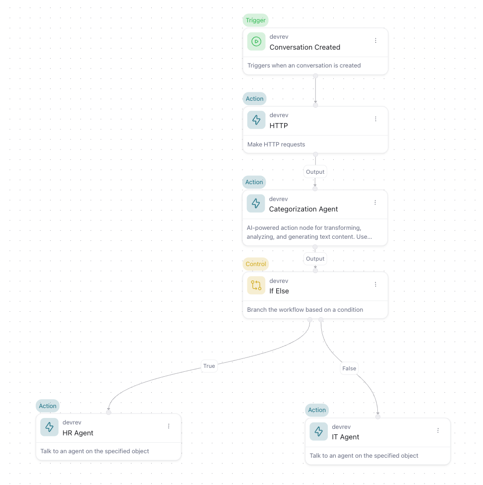{ width=50% }

  *Image 61. The ready canvas for the workflow.*  

## Validate and deploy the workflow
Now that we have the workflow ready, we need to make sure we can use it with Computer for End-users (PLuG).

➔ Click **Validate** in the top right corner of the canvas and click **Deploy** if there are no errors.

➔ Now that this workflow has been activated, we need to make sure that we disable any other workflows that are triggered for a new conversation. As we have such a workflow **Conversation Agent** (if you ran the second workshop!!!), click the workflow in the list of Workflows.

!!! Abstract
    If you don't wee the list of workflows, click the arrow pointing to the left in the breadcrumbs (:material-arrow-left:) to return to the full list of Workflows.

➔ Now that you see the canvas of the workflow, click in the top right corener the toggle switch which shows **Active** as text.

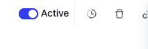

  *Image 62. The Active toggle switch.*  

➔ Disable this and the workflow will not intervene anymore with new conversations.

➔ Return to the workflows list and see that the workflow is removed from the Active list.

!!! Abstract "Be Aware"
    At the top of the screen there are three "buttons".

    1. **Active:** this is where the active buttons are shown
    2. **Paused:** this is where not-active workflows can be found; here you will see the just deactivated workflow
    3. **Draft:** this is where workflows are shown that are not *Validated* nor *Deployed*


    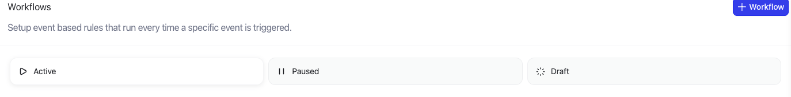

      *Image 63. The workflow categories with respect to status.*  

Now that we have **created** and **deactivated** (paused) a workflow we can test our work and the runs the workflow made.


   

<hr>

<font color="#FF6C0A" size="+2"><center><B>This concludes this module of the workshop</B></center></font>

<hr>