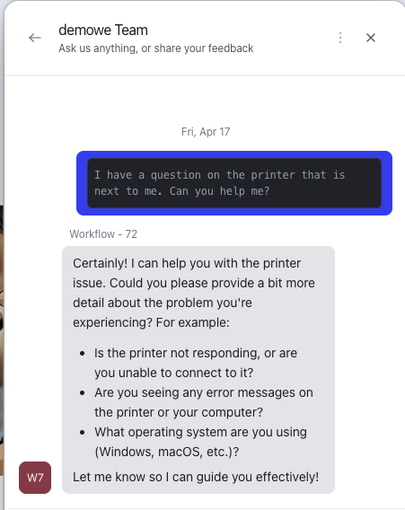
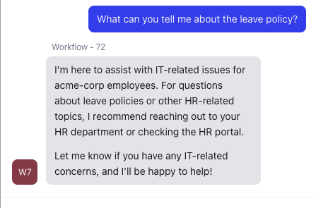

# Test using a conversation

**Objective**  
Test and first level troubleshoot of the created workflow.

**What you will build**

* Run a conversation and check that the correct agent is being used based on the first conversation (test categorization agent and IT or HR Agent)
* See the run of the workflow and if it took the correct path

**Exercise steps**

➔ Navigate on a new tab in your brwoser to <A HREF="https://www.hastingsdirect.com" target="New">https://www.hastingsdirect.com</a>.

➔ After a few seconds, your PluG Overlay manager should turn Green and the Computer of End-users should be shown.


  *Image 64. Computer for End-users shown.*  

!!! Warning "Try to remember the time of the conversation"
    As you are going to interact with the agent, make sure you remember the times you started the conversation as you need it in the next module"


## Test the HR agent

➔ Now ask the following question: ```Hello, I have a question on HR. can you help me?```

➔ After a few seconds you will see that the agent is replying with a remark that it is the HR Agent (assist you with HR Related questions).


  *Image 65. Start of the conversation and the answer.*  

➔ Now ask the question: ```What can you tell me about holiday days?```


  *Image 66. Second question and the answer.*  

➔ Now let's see what happens when we ask a different question, which is not HR related. Ask ```How do I connect a printer?```

➔ As you can see the HR Agent is providing a message that it is unabe to answer your questions as it is s HR speciliast. I also tell you to connect to the support desk.


  *Image 67. The negative answer .*  

➔ Type **Close the conversation**, to tell the HR agent we have our answer.

## Test the IT agent

Now we know we have two agents, let's try the other one. Start a new message and repeat the steps you ran for the HR agent but use these questions:

1. ```I have a question on the printer that is next to me. Can you help me?``` and see that the agent is replying to your query as a It technician. It want some detailed inforamtion specific to the printer, error messages and the OS.

    

    *Image 68. Computer answer .*  

2. Respond with ```I need to connect it to my computer```
3. It will reply with some extra information it needs.
4. Just respond with ```I'm using Mac OS```
5. All these question can be answered as they are in the realm of the IT Agent. 

6. Now if we try to ask something about holiday days, we will get a answer in the line off, sorry I'm an IT Agent and cannot help with HR questions.

    

    *Image 69. Computer answer .*  


 

<hr>

<font color="#FF6C0A" size="+2"><center><B>This concludes this module of the workshop</B></center></font>

<hr>