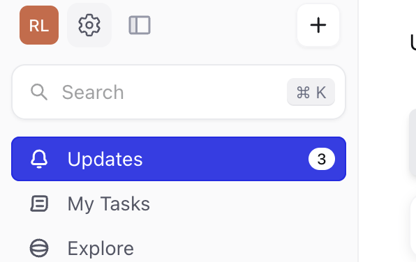
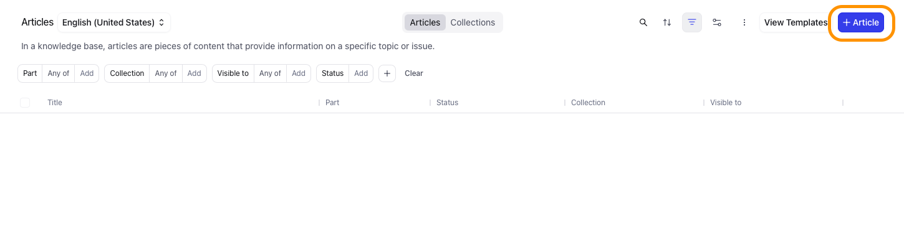
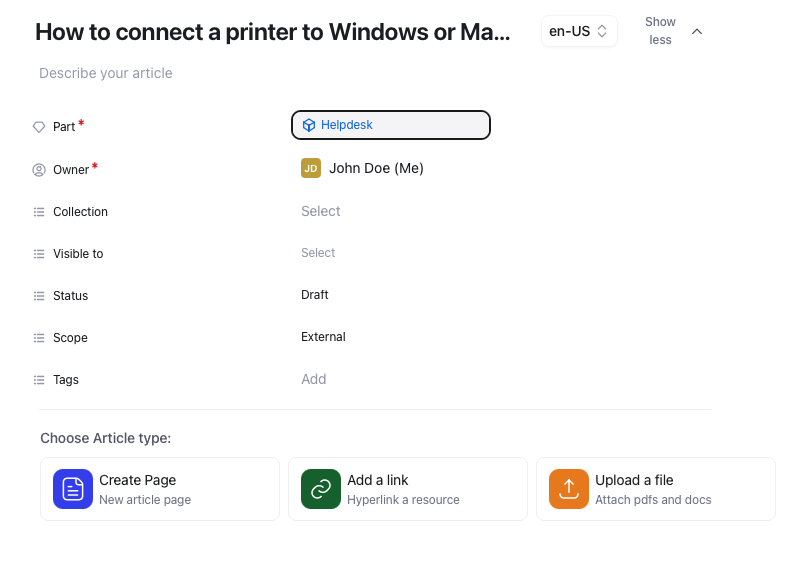
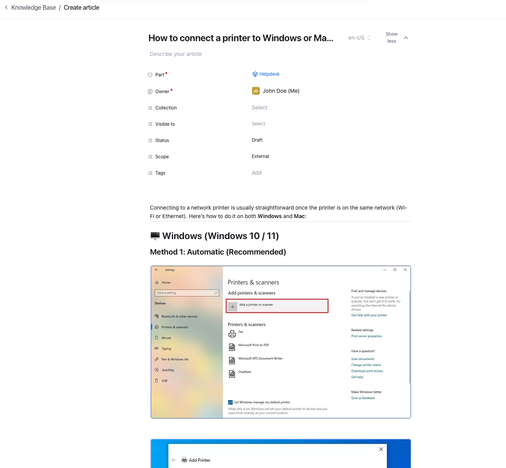
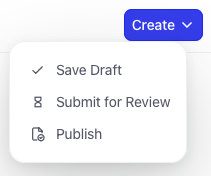
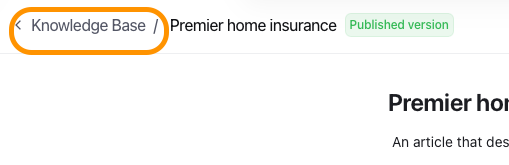
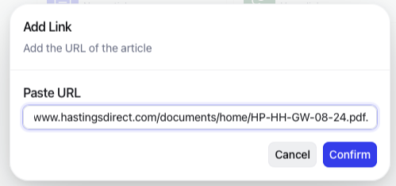
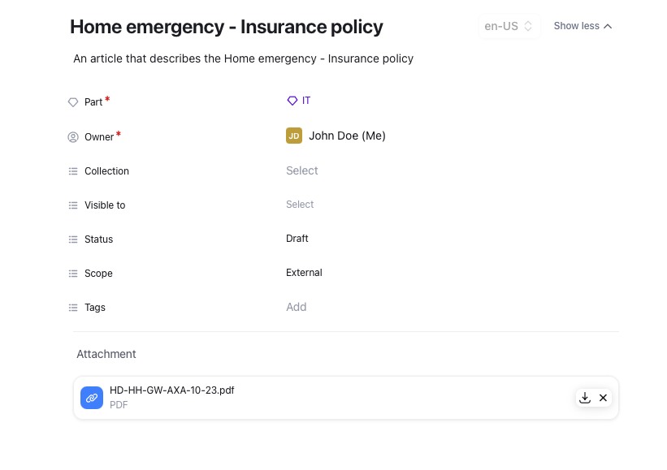

# Lab 1\. Exercise 2: Creating the KB articles {#lab-1.-exercise-2:-creating-the-kb-articles}

**Objective**

Create articles that can be used to answer questions from humans by using AI.

**What You Will Build**

* Manual creation of Articles

* Website scrapping

* Use AirSync from Confluence or Notion

**Exercise steps**

## Manual creation of Articles {#manual-creation-of-articles}

➔  Go to the **Settings** menu and click on **Knowledge Base**. You can find the settings menu via the cogwheel icon all the way at the top of the sidebar menu, next to your initials   

*Image 14\. Settings icon next to user initials.*

➔ Then in the top right of the window click **\+Article**

*Image 15\. Create Article..*

➔ In the screen that appears provide the following information:

1. **Title:** How to connect a printer to Windows or Mac O/S  
2. **Describe your article:** An article that describes how to connect a printer on Windows and Mac O/S       
3. **Part:** As part he selects IT \-\> Helpdesk as this is an article that could be used in Helpdesk tasks

➔ Leave the rest default, there are three options shown

* Create Page — use the rich-text editor to author content directly in DevRev  
* Add a link — paste a URL to an externally hosted article (opens in a new tab for readers)  
* Upload a file — attach a PDF or MS Word document

*Image 16\. Article options overview.*

➔ Select the Create a Page option  
➔ Open a new tab and use ChatGPT with the prompt  
    “*How to connect to a network printer for Windows or Mac O/S*”  
➔ Copy the answer into the Article on the other tab

*Image 17\. Article copy from ChatGPT.*

➔ Click the Create button in the top right corner of the screen. In the menu that opens click the Publish.

*Image 18\. Create and Publish.*

!!! Info
    The other options are:
    
    1. **Save Draft:** the current changes are not deleted. It might be that some more research is needed to create a good article.  
    2. **Publish:** This can be used to have another Administrator looking at the article to check the information and then publish the article.

➔ Use the breadcrumbs at the top of the screen and click the Knowledge Base text  

*Image 19\. Follow the breadcrumbs.*

➔ Create a new article using the same steps as before and provides the following parameters:

1. **Title:** Premier home insurance  
2. **Describe your article:** An article that describes the Policy for Premier home insurance      
3. **Part:** As part he selects Insurance as this article is related to that part

➔ Click the icon Add a link and paste this link [https://www.hastingsdirect.com/documents/home/HP-HH-GW-08-24.pdf](https://www.hastingsdirect.com/documents/home/HP-HH-GW-08-24.pdf) and click Confirm.  

*Image 20\. Add an article with a Link*

➔ **Publishes** the article and uses the *Knowledge Base* breadcrumb to get back to the overview of articles.  
➔ Create a new article with the following parameters:

1. **Title:** Home emergency \- Insurance policy  
2. **Describe your article:** An article that describes the Home emergency \- Insurance policy      
3. **Part:** As part select *Insurance* as this article is related to that part

➔ Download this file from the Hastings website [https://www.hastingsdirect.com/documents/home/HD-HH-GW-AXA-10-23.pdf](https://www.hastingsdirect.com/documents/home/HD-HH-GW-AXA-10-23.pdf) and use the downloaded file for the upload.  
➔ Click the **Upload a File** option and use the just download file as Upload  

*Image 21\. An article with an uploaded file.*

➔ Publishes the article.

<B>This concludes this module of the workshop</B>

