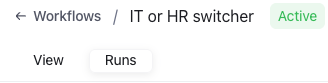
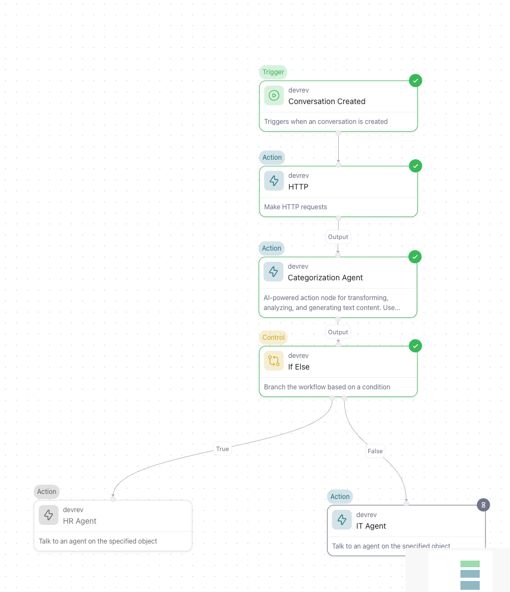
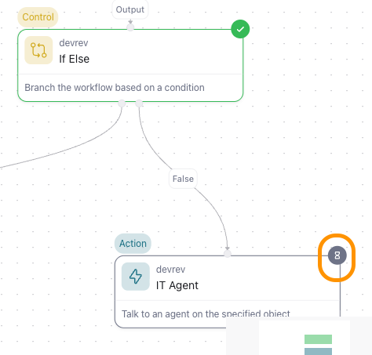
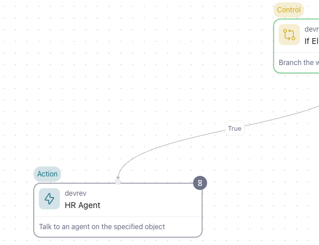
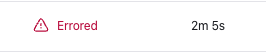
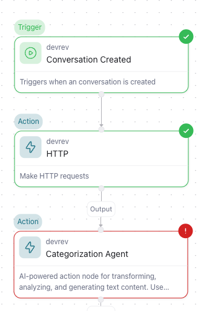
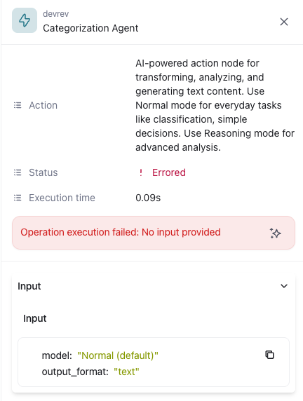

# See the log of a workflow

**Objective**

Check the runs (logs) of workflows

**What You Will Build**

* Check the workflows that have been run

**Exercise steps**

➔ Navigate back to the tab where your DevRev environment is.
➔ Go to the **Settings** menu and click on **Workflows**.
➔ In the Workflow list, click the **IT or HR switcher** workflow and the canvas we saw/created earlier is shown.
➔ At the top, just under the breadcrumbs you will see two tabs, **View** to see the canvas, but also the **Run** tab. Click this tab and see the runs that have ran and/or are in waiting state.

  *Image 70. The Runs Tab.*  

➔ Click one of the **Waiting** runs and see the flow of the conversation. Below screen shot is for the IT related questions. 

{ width=50% }

  *Image 71. The run for IT agent.*  

➔ As you can see the run is running in the **IT Agent** node as it has a hourglass on the node.

  *Image 72. The running IT node.*  

➔ For a HR Agent (hence the remark to remember the time of the conversation) you will see that the hourglass is on the HR Agent node.

{ width=45% }

  *Image 73. The running HR node .*  

!!! Abstract "Good to know"
    When there is an Error node, as shown below.

    

    *Image 74. A failed run.*  

    Click the run and get more information on the nodes and the run. The node that has a **red border and dot** with an exclamation mark is the failed noe in the workflow.

    { width=30% }

    *Image 75. The failed run nodes.*

    When the failing node is clicked, more detailed infomation will be shown to help in the troubleshooting.

    { width=30% }

    *Image 76. The detailed failed node.*
    
    The reason for this failure was that the **Prompt** for the agent has not been setup and it could not reason and answer the question.

This workshop has been using some simple agent configurations and should be seen as a starting point for next modules.

<B>This concludes this module of the workshop</B>

