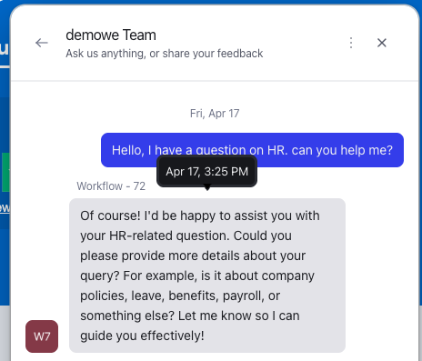
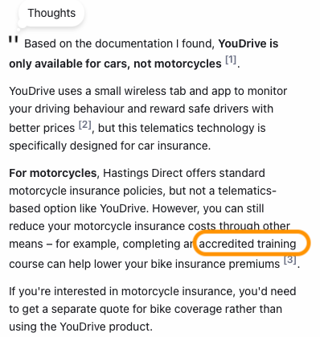
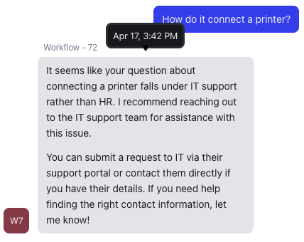

# Lab 2\. Exercise 1: Testing AI Agent (Computer) {#lab-2.-exercise-1:-testing-ai-agent-(computer)}

**Objective**

Test the AI Agent to use the created and AirSync-ed Knowledge Base articles to answer questions. Not just very simple questions that are straightforward but also complex questions that require reasoning.

**What You Will Build**

* Configure an AI agent  
* Test the AI Agent

**Exercise steps**

Now that we have some experience with articles, manual creation, web scrapper and AirSync, we need to test the AI Agent to see what we get back from some queries.

## Step 1: No Internet Access check {#step-1:-no-internet-access-check}

First we want to make sure the AI Agent is not able to connect to the internet and search for answers. 

➔ Navigate to **Settings \-\> Computer** all the way at the bottom of the Settings navigation pane in the *Workflow* section.

*Image 54\. The location of the Computer settings*

➔ We see here that the Web search is not enabled, as we see a button called **Enable web search** to enable the Web Search, which we will no toggle. So the Agent can only search the articles that have been created/imported.

*Image 55\. The location of the Web search enabled button.*

➔ Click **< Settings** at the top of the navigation pane to return to the “normal” user’s UI.

*Image 56\. The text < Settings to click.*

## Step 2: Test 1 \- A relative simple question {#step-2:-test-1---a-relative-simple-question}

➔ Click the text **“Let’s do this”** at the bottom of the navigation pane.   

*Image 56\. The button Let’s do this to click.*

➔ Ask the following question:”*What can you tell me about the Car insurance Policy?*”. You will see that the agent is going through the “onboard” articles to find answers. After a few seconds Computer generates an answer which looks something like:  
“   
*Based on the documentation I found, here's what I can tell you about the car insurance policy:*

*Policy documents and coverage*

*The car insurance policy from Hastings Direct includes comprehensive policy documents and wording that outline your coverage [\[1\]](https://www.hastingsdirect.com/car-insurance/policy-info/policy-booklets). The policy offers several types of coverage options:*

*Types of cover available*

* *Comprehensive policies – Hastings Direct and Hastings Premier comprehensive car insurance policies are Defaqto 5 Star rated [\[2\]](https://www.hastingsdirect.com/car-insurance/multi-car-insurance/).*  
* *Third party, fire & theft – A more limited coverage option [\[3\]](https://www.hastingsdirect.com/car-insurance/policy-features/windscreen-cover/).*  
* *Hastings Essential policy – A basic coverage tier [\[3\]](https://www.hastingsdirect.com/car-insurance/policy-features/windscreen-cover/).*

*Standard inclusions*

* *Windscreen cover – Car window and windscreen cover comes as standard on comprehensive policies [\[3\]](https://www.hastingsdirect.com/car-insurance/policy-features/windscreen-cover/). You can book repairs through National Windscreens [\[3\]](https://www.hastingsdirect.com/car-insurance/policy-features/windscreen-cover/).*

*Optional add-ons*

* *Hire car cover – Available for customers to add, covering hire costs after the insurer confirms they'll deal with your claim in writing [\[4\]](https://www.hastingsdirect.com/car-insurance/policy-features/hire-car).*  
* *Personal accident cover – Enhanced cover providing additional benefits for you and up to six passengers [\[5\]](https://www.hastingsdirect.com/car-insurance/policy-features/personal-accident).*

*Claims and requirements*

*You're required to notify your insurer of any incident [\[4\]](https://www.hastingsdirect.com/car-insurance/policy-features/hire-car). Full terms and conditions are available in the additional products booklet.*

*Would you like more details about any specific aspect of the policy?*

“

➔ Click on the Thoughts text and see what the agent has done to get to the answer.

*Image 57\. The first reply of the AI Agent.*

➔ The sources that the Agent used, with reasoning, to formulate the answer are shown at the bottom of the answer. In this case 5 sources.

➔ Click the **Sources** text and see the sources

*Image 58\. The sources the AI Agent used.*

## Step 3: Test 3 \- A more complex question {#step-3:-test-3---a-more-complex-question}

Now that we are getting an answer to a relatively simple question that cannot have come from the internet, ask a more complex question. 

➔ The question to raise is:”*Is there a insurance that can be used for low amount of driven miles?*”.

Again the Agent reach out to the articles and queries the information to find an answer:  
“  
*Yes\! There's a good option for low mileage driving. YouDrive is Hastings Direct's telematics insurance policy that's designed to reward safe drivers and can help you save money if you drive fewer miles [\[1\]](https://www.hastingsdirect.com/car-insurance/guides/new-driver-costs/).*

*How it works for low mileage*

*With YouDrive, you estimate your annual mileage when you take out the policy. The key benefit is that there's no limit on the number of miles you can drive within a year – so you won't be penalized if you drive less than expected [\[2\]](https://www.hastingsdirect.com/car-insurance/guides/new-drivers/myth-busting-telematics/). This makes it ideal if you're uncertain about your exact mileage or drive infrequently.*

*How to save money*

* *Reduce mileage – The more you're out on the road, the more of a risk insurers perceive you to be. Therefore, reducing your annual mileage can help you save money on your premium [\[1\]](https://www.hastingsdirect.com/car-insurance/guides/new-driver-costs/).*  
* *Drive safely – Your renewal price is based on your driving behaviour. If you drive safely and sensibly, you'll pay less [\[3\]](https://www.hastingsdirect.com/car-insurance/telematics-insurance/).*

*What YouDrive includes*

* *A small wireless tab (instead of a complicated black box) that monitors your driving [\[3\]](https://www.hastingsdirect.com/car-insurance/telematics-insurance/).*  
* *An app to track and improve your driving score [\[2\]](https://www.hastingsdirect.com/car-insurance/guides/new-drivers/myth-busting-telematics/).*  
* *Savings from day one, and every year if you continue to drive well [\[3\]](https://www.hastingsdirect.com/car-insurance/telematics-insurance/).*

*YouDrive is the UK's market-leading telematics product, so it's a solid choice if you're looking to keep costs down with lower mileage [\[4\]](https://www.hastingsdirect.com/about-us/).*

“

*Image 59\. The more complex answer to the question.*

## Step 4: Test 4 \- Having a conversation {#step-4:-test-4---having-a-conversation}

➔ Based on the answer with *YouDrive* we want to know more about that option. So ask:“*Now you found the YouDrive insurance, but can that also be used for motorcycles?*”. Computer thinks a bit and replies with an answer that provides something in the line of, that YouDrive is not available for Motor cycles, but there are other options for lowering the cost of an insurance. 

➔ One option is interesting in the answer give: “accredited training”. 

*Image 59\. The interesting option*

➔ We want to know more on that option ask:”*What are those accredited trainings you refer to?*”. Computer is thinking again and comes back with a great answer by reasoning and looking at the information it has access to:  
”

*Great question\! There are several types of accredited training courses available for motorcycle riders that can help lower your insurance premiums:*

*Advanced qualifications recognised by insurers*

*Gaining an advanced qualification can lead to cheaper motorcycle cover, as long as it's recognised by your insurance provider. These include [\[1\]](https://www.hastingsdirect.com/motorbike-insurance/multi-bike-insurance):*

* *BikeSafe certificate – A safety-focused training programme.*  
* *Enhanced Rider Scheme – Advanced training to improve your riding skills.*  
* *RoSPA Advanced Motorcycle Training – Professional advanced training from the Royal Society for thePrevention of Accidents.*

*Advanced riding courses*

*Taking an advanced riding course will help you emphasise safety, understand the power of your bike, and could result in an insurance premium discount [\[2\]](https://www.hastingsdirect.com/motorbike-insurance/guides/bike-safety).*

*Compulsory Basic Training (CBT)*

*If you're a beginner, the Compulsory Basic Training (CBT) course is a legal requirement (unless you obtained a full car licence before February 2001). The CBT involves on-site training and riding as well as driving on the road with a trained guide. Once completed, you'll receive a certificate (DL196) that lasts for up to 2 years [\[3\]](https://www.hastingsdirect.com/motorbike-insurance/guides/bike-beginners-guide/).*

*The key takeaway is that investing in any of these recognised training courses not only improves your safety on the road but can also help reduce your motorcycle insurance premiums.*

“

## Step 5: Test 5 \- Ask an internet access question {#step-5:-test-5---ask-an-internet-access-question}

➔ To be sure that the agent cannot access the internet ask the following question:”*What can you tell me about the ACME corporation*”. Even though there is no real information, which is given by the agent, it still provides a professional answer that “  
*“*  
*I couldn’t find any information*. *Not just articles, but also searches for an answer in accounts and opportunities.*  
*“*

*Image 60\. Random question asked and answered by AI Agent*

<B>This concludes this module of the workshop</B>

